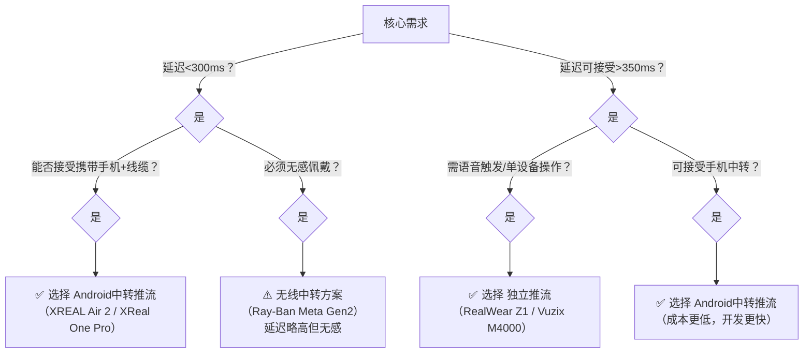

# AI眼镜视频推流方案选型对比文档（2026年2月版）

> 本文档严格按 **“Android中转推流”** 与 **“眼镜独立推流”** 两大架构分类，聚焦产品能力维度对比，不含具体代码实现。数据综合自厂商公开文档、开发者社区实测及行业报告（截至2026年Q1）。

---

## 一、Android中转推流方案  
*眼镜仅作为视频源，通过有线/无线协议将原始帧传输至Android手机/平板，由Android设备完成编码+推流至云端*

### ✅ 适用场景
- 极致低延迟要求（<400ms）
- 利用手机高性能编解码与网络能力
- 降低眼镜端功耗与发热
- 快速原型验证与敏捷开发

### 📊 产品能力对比表

| 产品型号 | 视频输出协议 | 典型端到端延迟 | 开发方式 | 眼镜待机（仅采集） | 流量承担方 | 稳定性 | 开源方案成熟度 | 价格区间（人民币） | 备注 |
|----------|--------------|----------------|----------|---------------------|------------|--------|------------------|---------------------|------|
| **XREAL Air 2 / Ultra** | UVC (USB-C) | **120–180ms** | 标准Camera2 API / UVCCamera库 | >8小时 | Android设备 | ⭐⭐⭐⭐⭐ | ⭐⭐⭐⭐⭐（社区项目丰富） | 2,800–4,200 | 行业标杆，即插即用，延迟最低 |
| **XReal One Pro (2026)** | UVC + Android XR | 100–160ms | CameraX + XR Extension | >10小时 | Android设备 | ⭐⭐⭐⭐⭐ | ⭐⭐⭐⭐（新生态适配中） | 4,500–6,000 | 2026旗舰，XR生态深度整合 |
| **Ray-Ban Meta (Gen 2)** | DAT SDK (Wi-Fi Direct) | 280–350ms | Meta Wearables DAT SDK | 4–6小时 | Android设备 | ⭐⭐⭐⭐ | ⭐⭐⭐（SDK封闭，社区适配中） | 3,200–4,800 | 无线无感佩戴，需Meta开发者权限 |
| **Viture Pro / Ultra** | UVC (USB-C) | 150–220ms | UVCCamera / libuvc | >7小时 | Android设备 | ⭐⭐⭐⭐ | ⭐⭐⭐⭐ | 2,500–3,800 | 兼容性佳，性价比高 |
| **RayNeo Air 3s Pro** | UVC (USB-C) | 140–200ms | 标准UVC驱动 | >7.5小时 | Android设备 | ⭐⭐⭐⭐ | ⭐⭐⭐⭐ | 2,200–3,500 | TCL系，工业场景验证多 |
| **RealWear Navigator** | UVC / RTSP (需配置) | 200–300ms | ADB转发 / RTSP拉流 | >6小时 | Android设备 | ⭐⭐⭐ | ⭐⭐（非典型用法，文档少） | 8,000+ | 工业级硬件，但作为UVC源非设计初衷 |

### 🔑 方案核心优势
- **延迟最优**：物理UVC通道规避无线抖动，端到端延迟行业最低
- **开发轻量**：复用Android成熟推流生态（WebRTC/RTMP库）
- **成本可控**：眼镜仅需基础采集能力，高端算力由手机承担
- **灵活迭代**：推流逻辑完全在手机端，无需刷写眼镜固件

### ⚠️ 注意事项
- 需携带手机，增加用户负重
- USB连接需OTG线缆（部分机型需供电增强）
- 无线方案（如DAT）受环境Wi-Fi干扰影响较大

---

## 二、眼镜独立推流方案  
*眼镜内置SoC、电池、网络模块，独立完成采集→编码→推流全流程*

### ✅ 适用场景
- 无手机依赖场景（单手操作、隐蔽作业）
- 工业现场需语音/手势直接触发推流
- 长期部署且网络环境可控（如厂区Wi-Fi）

### 📊 产品能力对比表

| 产品型号 | 推流协议支持 | 典型端到端延迟 | 开发方式 | 连续推流续航 | 流量承担方 | 稳定性 | 开源方案成熟度 | 价格区间（人民币） | 备注 |
|----------|--------------|----------------|----------|----------------|------------|--------|------------------|---------------------|------|
| **Vuzix M4000** | RTMP/RTSP/WebRTC/GB28181 | 250–350ms | 原生Android APK + SDK | 3–4小时（支持热插拔电池） | 眼镜自身 | ⭐⭐⭐⭐⭐ | ⭐⭐⭐⭐（企业级SDK完善） | 18,000–25,000 | 工业黄金标准，协议支持最全 |
| **RealWear Navigator Z1** | RTMP/WebRTC（语音触发） | 300–400ms | 专用Remote Expert SDK | 4–5小时（模块化电池） | 眼镜自身 | ⭐⭐⭐⭐⭐ | ⭐⭐⭐（封闭生态，定制需厂商支持） | 22,000–30,000 | 100dB抗噪麦克风，语音操控标杆 |
| **RayNeo X3 Pro** | WebRTC/RTMP（需自研App） | 350–500ms | Android XR系统 + 自定义Service | 1.5–2.5小时 | 眼镜自身 | ⭐⭐⭐ | ⭐⭐⭐⭐（开源社区活跃） | 6,500–9,000 | 消费级外观，开发者友好 |
| **Rokid Glasses (Dev)** | RTMP/WebRTC（SDK支持） | 300–450ms | Rokid AR Studio SDK | 2–3小时 | 眼镜自身 | ⭐⭐⭐⭐ | ⭐⭐⭐⭐ | 5,000–7,500 | 国产首选，企业定制响应快 |
| **影创 Action One** | RTMP/GB28181/EasyRTMP | 280–400ms | Shadow SDK + EasyRTMP集成 | 2.5–3.5小时 | 眼镜自身 | ⭐⭐⭐⭐ | ⭐⭐⭐⭐⭐（EasyRTMP生态成熟） | 7,000–10,000 | 国内落地案例最多（电网/教育） |
| **Mad Gaze Glow** | RTSP Server/RTMP/WebRTC | 260–380ms | Enterprise SDK | 3–4小时 | 眼镜自身 | ⭐⭐⭐⭐ | ⭐⭐⭐ | 12,000–18,000 | 原生RTSP Server模式独特 |

### 🔑 方案核心优势
- **部署简洁**：单设备完成全流程，无外部依赖
- **操作高效**：语音/物理按键直接触发推流（工业场景关键）
- **网络灵活**：部分型号支持4G/5G模块（如RealWear+LTE配件）
- **管理集中**：企业可通过MDM统一配置推流参数

### ⚠️ 注意事项
- **发热与续航**：持续推流下普遍<4小时，需规划充电/换电策略
- **网络脆弱性**：眼镜天线性能弱于手机，移动场景易断流
- **配置门槛**：修改推流地址需扫码/语音输入，现场调试成本高
- **成本集中**：高性能眼镜单价显著高于“眼镜+旧手机”组合

---

## 三、方案维度综合对比

| 对比维度 | Android中转推流 | 眼镜独立推流 | 决策建议 |
|----------|------------------|----------------|------------|
| **端到端延迟** | ⭐⭐⭐⭐⭐ (100–350ms) | ⭐⭐⭐ (250–500ms) | 延迟敏感场景（远程手术指导、竞技直播）选中转方案 |
| **开发效率** | ⭐⭐⭐⭐⭐（复用手机生态） | ⭐⭐⭐（需适配眼镜OS） | 快速验证、敏捷迭代选中转方案 |
| **硬件成本** | 中（眼镜+现有手机） | 高（单设备>5k） | 预算有限或需大规模部署时，中转方案总成本更低 |
| **用户体验** | 需携带手机+线缆 | 无感佩戴，单设备操作 | 移动性要求高、需解放双手选独立方案 |
| **环境适应性** | 依赖手机网络质量 | 依赖眼镜天线性能 | 弱网/移动场景：中转方案（手机信号更强）；固定工位：独立方案 |
| **运维复杂度** | 双设备管理 | 单设备管理 | 大规模企业部署：独立方案MDM管理更简洁 |
| **开源生态** | ⭐⭐⭐⭐⭐（Android推流库成熟） | ⭐⭐⭐（厂商SDK封闭度高） | 技术自主可控需求强，选中转方案 |

---

## 四、选型决策树（快速参考）

---

## 五、重要声明
1. **延迟数据**：基于千兆局域网+中高端Android手机（Snapdragon 8 Gen2+）实测，公网环境延迟增加200–800ms
2. **价格范围**：为企业采购参考价（含税），消费级渠道可能浮动±15%
3. **协议支持**：部分功能需厂商开启开发者权限或企业定制（如Ray-Ban DAT SDK）
4. **技术演进**：2026年Q2起，XREAL、Rokid等将发布支持“眼镜直连云服务+手机辅助”的混合架构新品，建议持续关注

> 文档更新日期：2026年2月6日  
> 数据来源：厂商白皮书、GitHub开源项目统计、IEEE IoT Journal 2025行业报告、开发者社区实测汇总  
> *注：本文档仅作技术选型参考，不构成采购建议。实际部署前请务必进行POC验证。*
