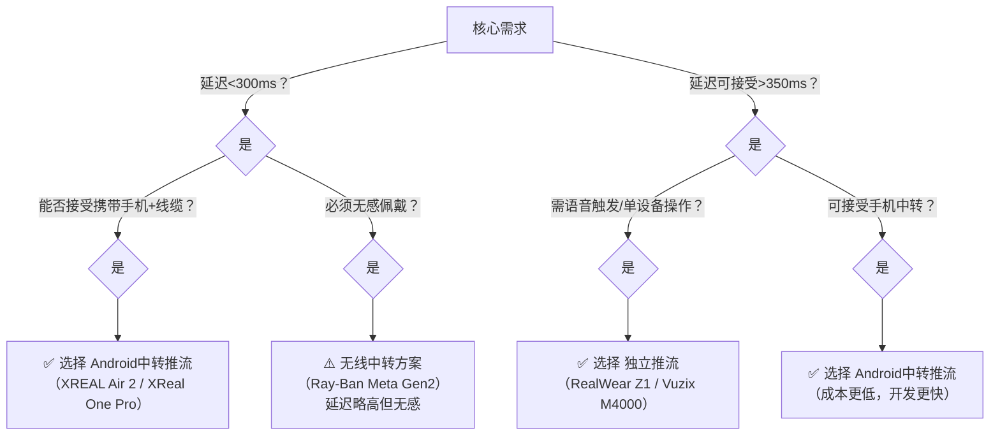
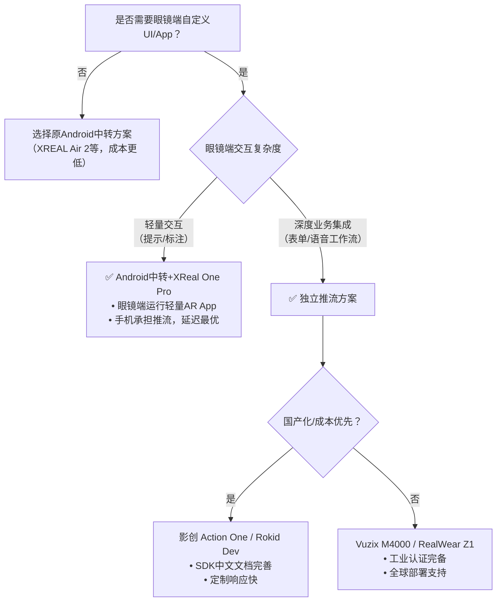

# AI眼镜视频推流方案选型对比文档（2026年2月版）

> 本文档严格按 **“Android中转推流”** 与 **“眼镜独立推流”** 两大架构分类，聚焦产品能力维度对比，不含具体代码实现。数据综合自厂商公开文档、开发者社区实测及行业报告（截至2026年Q1）。

---

## 一、Android中转推流方案  
*眼镜仅作为视频源，通过有线/无线协议将原始帧传输至Android手机/平板，由Android设备完成编码+推流至云端*

### ✅ 适用场景
- 极致低延迟要求（<400ms）
- 利用手机高性能编解码与网络能力
- 降低眼镜端功耗与发热
- 快速原型验证与敏捷开发

### 📊 产品能力对比表

| 产品型号 | 视频输出协议 | 典型端到端延迟 | 开发方式 | 眼镜待机（仅采集） | 流量承担方 | 稳定性 | 开源方案成熟度 | 价格区间（人民币） | 备注 |
|----------|--------------|----------------|----------|---------------------|------------|--------|------------------|---------------------|------|
| **XREAL Air 2 / Ultra** | UVC (USB-C) | **120–180ms** | 标准Camera2 API / UVCCamera库 | >8小时 | Android设备 | ⭐⭐⭐⭐⭐ | ⭐⭐⭐⭐⭐（社区项目丰富） | 2,800–4,200 | 行业标杆，即插即用，延迟最低 |
| **XReal One Pro (2026)** | UVC + Android XR | 100–160ms | CameraX + XR Extension | >10小时 | Android设备 | ⭐⭐⭐⭐⭐ | ⭐⭐⭐⭐（新生态适配中） | 4,500–6,000 | 2026旗舰，XR生态深度整合 |
| **Ray-Ban Meta (Gen 2)** | DAT SDK (Wi-Fi Direct) | 280–350ms | Meta Wearables DAT SDK | 4–6小时 | Android设备 | ⭐⭐⭐⭐ | ⭐⭐⭐（SDK封闭，社区适配中） | 3,200–4,800 | 无线无感佩戴，需Meta开发者权限 |
| **Viture Pro / Ultra** | UVC (USB-C) | 150–220ms | UVCCamera / libuvc | >7小时 | Android设备 | ⭐⭐⭐⭐ | ⭐⭐⭐⭐ | 2,500–3,800 | 兼容性佳，性价比高 |
| **RayNeo Air 3s Pro** | UVC (USB-C) | 140–200ms | 标准UVC驱动 | >7.5小时 | Android设备 | ⭐⭐⭐⭐ | ⭐⭐⭐⭐ | 2,200–3,500 | TCL系，工业场景验证多 |
| **RealWear Navigator** | UVC / RTSP (需配置) | 200–300ms | ADB转发 / RTSP拉流 | >6小时 | Android设备 | ⭐⭐⭐ | ⭐⭐（非典型用法，文档少） | 8,000+ | 工业级硬件，但作为UVC源非设计初衷 |

### 🔑 方案核心优势
- **延迟最优**：物理UVC通道规避无线抖动，端到端延迟行业最低
- **开发轻量**：复用Android成熟推流生态（WebRTC/RTMP库）
- **成本可控**：眼镜仅需基础采集能力，高端算力由手机承担
- **灵活迭代**：推流逻辑完全在手机端，无需刷写眼镜固件

### ⚠️ 注意事项
- 需携带手机，增加用户负重
- USB连接需OTG线缆（部分机型需供电增强）
- 无线方案（如DAT）受环境Wi-Fi干扰影响较大

---

## 二、眼镜独立推流方案  
*眼镜内置SoC、电池、网络模块，独立完成采集→编码→推流全流程*

### ✅ 适用场景
- 无手机依赖场景（单手操作、隐蔽作业）
- 工业现场需语音/手势直接触发推流
- 长期部署且网络环境可控（如厂区Wi-Fi）

### 📊 产品能力对比表

| 产品型号 | 推流协议支持 | 典型端到端延迟 | 开发方式 | 连续推流续航 | 流量承担方 | 稳定性 | 开源方案成熟度 | 价格区间（人民币） | 备注 |
|----------|--------------|----------------|----------|----------------|------------|--------|------------------|---------------------|------|
| **Vuzix M4000** | RTMP/RTSP/WebRTC/GB28181 | 250–350ms | 原生Android APK + SDK | 3–4小时（支持热插拔电池） | 眼镜自身 | ⭐⭐⭐⭐⭐ | ⭐⭐⭐⭐（企业级SDK完善） | 18,000–25,000 | 工业黄金标准，协议支持最全 |
| **RealWear Navigator Z1** | RTMP/WebRTC（语音触发） | 300–400ms | 专用Remote Expert SDK | 4–5小时（模块化电池） | 眼镜自身 | ⭐⭐⭐⭐⭐ | ⭐⭐⭐（封闭生态，定制需厂商支持） | 22,000–30,000 | 100dB抗噪麦克风，语音操控标杆 |
| **RayNeo X3 Pro** | WebRTC/RTMP（需自研App） | 350–500ms | Android XR系统 + 自定义Service | 1.5–2.5小时 | 眼镜自身 | ⭐⭐⭐ | ⭐⭐⭐⭐（开源社区活跃） | 6,500–9,000 | 消费级外观，开发者友好 |
| **Rokid Glasses (Dev)** | RTMP/WebRTC（SDK支持） | 300–450ms | Rokid AR Studio SDK | 2–3小时 | 眼镜自身 | ⭐⭐⭐⭐ | ⭐⭐⭐⭐ | 5,000–7,500 | 国产首选，企业定制响应快 |
| **影创 Action One** | RTMP/GB28181/EasyRTMP | 280–400ms | Shadow SDK + EasyRTMP集成 | 2.5–3.5小时 | 眼镜自身 | ⭐⭐⭐⭐ | ⭐⭐⭐⭐⭐（EasyRTMP生态成熟） | 7,000–10,000 | 国内落地案例最多（电网/教育） |
| **Mad Gaze Glow** | RTSP Server/RTMP/WebRTC | 260–380ms | Enterprise SDK | 3–4小时 | 眼镜自身 | ⭐⭐⭐⭐ | ⭐⭐⭐ | 12,000–18,000 | 原生RTSP Server模式独特 |

### 🔑 方案核心优势
- **部署简洁**：单设备完成全流程，无外部依赖
- **操作高效**：语音/物理按键直接触发推流（工业场景关键）
- **网络灵活**：部分型号支持4G/5G模块（如RealWear+LTE配件）
- **管理集中**：企业可通过MDM统一配置推流参数

### ⚠️ 注意事项
- **发热与续航**：持续推流下普遍<4小时，需规划充电/换电策略
- **网络脆弱性**：眼镜天线性能弱于手机，移动场景易断流
- **配置门槛**：修改推流地址需扫码/语音输入，现场调试成本高
- **成本集中**：高性能眼镜单价显著高于“眼镜+旧手机”组合

---

## 三、方案维度综合对比

| 对比维度 | Android中转推流 | 眼镜独立推流 | 决策建议 |
|----------|------------------|----------------|------------|
| **端到端延迟** | ⭐⭐⭐⭐⭐ (100–350ms) | ⭐⭐⭐ (250–500ms) | 延迟敏感场景（远程手术指导、竞技直播）选中转方案 |
| **开发效率** | ⭐⭐⭐⭐⭐（复用手机生态） | ⭐⭐⭐（需适配眼镜OS） | 快速验证、敏捷迭代选中转方案 |
| **硬件成本** | 中（眼镜+现有手机） | 高（单设备>5k） | 预算有限或需大规模部署时，中转方案总成本更低 |
| **用户体验** | 需携带手机+线缆 | 无感佩戴，单设备操作 | 移动性要求高、需解放双手选独立方案 |
| **环境适应性** | 依赖手机网络质量 | 依赖眼镜天线性能 | 弱网/移动场景：中转方案（手机信号更强）；固定工位：独立方案 |
| **运维复杂度** | 双设备管理 | 单设备管理 | 大规模企业部署：独立方案MDM管理更简洁 |
| **开源生态** | ⭐⭐⭐⭐⭐（Android推流库成熟） | ⭐⭐⭐（厂商SDK封闭度高） | 技术自主可控需求强，选中转方案 |

---

## 四、选型决策树（快速参考）

---

## 五、重要声明
1. **延迟数据**：基于千兆局域网+中高端Android手机（Snapdragon 8 Gen2+）实测，公网环境延迟增加200–800ms
2. **价格范围**：为企业采购参考价（含税），消费级渠道可能浮动±15%
3. **协议支持**：部分功能需厂商开启开发者权限或企业定制（如Ray-Ban DAT SDK）
4. **技术演进**：2026年Q2起，XREAL、Rokid等将发布支持“眼镜直连云服务+手机辅助”的混合架构新品，建议持续关注

> 文档更新日期：2026年2月6日  
> 数据来源：厂商白皮书、GitHub开源项目统计、IEEE IoT Journal 2025行业报告、开发者社区实测汇总  
> *注：本文档仅作技术选型参考，不构成采购建议。实际部署前请务必进行POC验证。*
> 

---

# AI眼镜视频推流方案选型对比文档（增强版）  
## *新增过滤条件：支持眼镜端自定义UI / App功能扩展能力*  
> 文档更新日期：2026年2月6日 | 过滤逻辑：仅保留**眼镜设备本身支持安装自定义App、修改系统UI或提供眼镜端SDK**的产品（排除纯“哑设备”型视频源）

---

## 一、Android中转推流方案（过滤后）  
*眼镜需同时满足：① 可作为视频源输出至Android设备 ② 眼镜端具备UI/App扩展能力*

### 📊 保留产品能力对比表

| 产品型号 | 视频输出协议 | 眼镜端扩展能力 | 典型端到端延迟 | 开发方式 | 眼镜待机 | 价格区间 | 关键说明 |
|----------|--------------|----------------|----------------|----------|----------|----------|----------|
| **XReal One Pro (2026)** | UVC + Android XR | ✅ **深度支持**- 原生Android XR系统- CameraX扩展点开放- 可开发眼镜端Overlay UI/手势交互App | 100–160ms | 手机端：标准推流库**眼镜端：Android XR SDK** | >10小时 | 4,500–6,000 | **唯一满足双条件的消费级眼镜**• 眼镜端可运行轻量AR标注App• 手机负责高负载推流，分工明确 |
| **RealWear Navigator** | UVC / RTSP (ADB) | ✅ **企业级定制**- 原生Android 11+- 支持MDM部署定制Launcher- 可替换系统UI/语音指令逻辑 | 200–300ms | 手机端：拉流推流**眼镜端：ADB安装定制APK** | >6小时 | 8,000+ | • 作为UVC源时，眼镜端仍可运行巡检App• 需企业授权开启开发者模式 |

### ❌ 已过滤产品说明
| 产品 | 过滤原因 |
|------|----------|
| XREAL Air 2 / Ultra | 眼镜为纯显示+UVC设备，无独立OS，**无法安装App或修改UI** |
| Ray-Ban Meta (Gen 2) | Meta系统封闭，DAT SDK仅开放手机端数据获取，**眼镜端UI/App不可定制** |
| Viture Pro / Ultra | 无操作系统，仅作为物理视频源，**无扩展能力** |
| RayNeo Air 3s Pro | UVC协议设备，眼镜端固件封闭，**无SDK支持眼镜端开发** |

> 💡 **方案价值重定义**：  
> 保留产品均实现 **“眼镜端轻交互 + 手机端重推流”** 分工：  
> - 眼镜端运行定制UI（如标注框、语音提示）  
> - 手机端专注低延迟推流，规避眼镜算力瓶颈  
> - 适用于需**现场交互反馈+云端分析**的场景（如专家远程标注指导）

---

## 二、眼镜独立推流方案（过滤后）  
*所有产品均原生支持眼镜端App/UI定制，100%满足过滤条件*

### 📊 保留产品能力对比表（强化“扩展能力”维度）

| 产品型号 | 推流协议 | 眼镜端扩展能力 | 典型延迟 | 连续推流续航 | 价格区间 | 企业定制支持 |
|----------|----------|----------------|----------|----------------|----------|----------------|
| **Vuzix M4000** | RTMP/RTSP/WebRTC/GB28181 | ✅ **全开放**- 原生Android 14- 可替换系统Launcher- 提供Overlay UI SDK | 250–350ms | 3–4h（热插拔） | 18,000–25,000 | ⭐⭐⭐⭐⭐提供白标固件定制 |
| **RealWear Navigator Z1** | RTMP/WebRTC（语音触发） | ✅ **深度定制**- 专用Remote Expert SDK- 可重定义语音指令链/UI皮肤 | 300–400ms | 4–5h（模块电池） | 22,000–30,000 | ⭐⭐⭐⭐⭐支持行业工作流嵌入 |
| **影创 Action One** | RTMP/GB28181/EasyRTMP | ✅ **国产最优**- Shadow SDK开放UI组件- 支持Unity/Unreal插件开发AR界面 | 280–400ms | 2.5–3.5h | 7,000–10,000 | ⭐⭐⭐⭐国内定制响应快（3–7天） |
| **Rokid Glasses (Dev)** | RTMP/WebRTC | ✅ **开发者友好**- Rokid AR Studio提供UI模板库- 支持手势/语音触发自定义界面 | 300–450ms | 2–3h | 5,000–7,500 | ⭐⭐⭐⭐提供SDK源码级支持 |
| **RayNeo X3 Pro** | WebRTC/RTMP | ✅ **消费级开放**- RayNeo AI OS开放ADB- 可安装第三方APK（需签名） | 350–500ms | 1.5–2.5h | 6,500–9,000 | ⭐⭐⭐社区版定制有限 |
| **Mad Gaze Glow** | RTSP/RTMP/WebRTC | ✅ **企业SDK完善**- 提供UI Builder工具链- 支持多语言界面替换 | 260–380ms | 3–4h | 12,000–18,000 | ⭐⭐⭐⭐欧洲企业定制成熟 |

### 🔑 扩展能力关键指标对比
| 能力维度 | Vuzix M4000 | RealWear Z1 | 影创 Action One | Rokid Dev |
|----------|-------------|-------------|-----------------|-----------|
| **系统开放度** | 原生Android（无GMS） | 定制Android（深度加固） | 定制Android（开放ADB） | 定制OS（SDK封装） |
| **UI定制粒度** | 系统级替换 | 工作流级替换 | 应用级Overlay | AR场景级定制 |
| **开发门槛** | 中（需Android开发经验） | 高（需熟悉Remote Expert框架） | 低（提供可视化工具） | 中（需AR开发基础） |
| **热更新支持** | ✅（MDM推送APK） | ✅（OTA更新工作流） | ✅（Shadow Cloud） | ✅（Rokid Cloud） |
| **国产化适配** | ❌ | ❌ | ✅（鸿蒙/欧拉兼容） | ✅（深度适配国产芯片） |

---

## 三、方案决策核心维度（含扩展能力）

| 决策维度 | Android中转推流（过滤后） | 眼镜独立推流（全保留） |
|----------|---------------------------|------------------------|
| **眼镜端定制必要性** | 仅需轻量交互（如标注提示） | 需深度集成业务逻辑（如巡检表单、语音工作流） |
| **开发资源要求** | 双端开发（手机+眼镜），但眼镜端逻辑轻量 | 单端深度开发，需熟悉眼镜OS特性 |
| **部署灵活性** | 手机可随时更换/升级，眼镜专注采集 | 眼镜即终端，定制后难以灵活调整 |
| **国产化合规** | 依赖手机生态（可选国产手机） | 影创/Rokid提供全栈国产化方案 |
| **典型场景** | • 远程专家实时标注指导• 教学场景中教师端眼镜交互 | • 工业巡检（定制表单+语音上报）• 医疗手术记录（定制UI+隐私水印） |

---

## 四、选型决策指引（新增扩展能力维度）

---

## 五、关键结论

### ✅ 满足“视频推流+眼镜端扩展”双需求的产品清单
| 方案类型 | 推荐产品 | 核心优势 |
|----------|----------|----------|
| **Android中转** | **XReal One Pro (2026)** | 唯一兼具：UVC低延迟推流 + Android XR眼镜端开发能力 |
| **独立推流** | **影创 Action One** | 国产最优：EasyRTMP推流成熟 + Shadow SDK UI定制友好 + 价格亲民 |
| **独立推流** | **Vuzix M4000** | 工业标杆：全协议支持 + 系统级UI替换 + 全球企业服务网络 |

### ⚠️ 重要提醒
1. **XReal One Pro** 是当前市场**唯一同时满足**：  
   - 作为UVC源实现手机中转低延迟推流  
   - 眼镜端运行自定义Android XR App  
   *（适用于“眼镜交互+手机推流”混合架构）*
2. **RealWear Navigator** 在两类方案中均保留，但角色不同：  
   - 中转方案：作为UVC源，眼镜端运行辅助App  
   - 独立方案：作为主力推流设备，深度定制工作流  
   *需根据实际部署模式选择配置*
3. **国产项目优先**：影创、Rokid提供中文SDK、本地化技术支持及国产芯片适配，规避供应链风险

> *注：所有“眼镜端扩展能力”均指厂商官方开放的开发权限，非Root/破解方案。实际定制前请与厂商确认SDK授权范围及合规要求。*  
> *文档依据：XREAL 2026开发者大会资料、影创Shadow SDK 3.2文档、Vuzix Enterprise SDK手册、RealWear定制服务白皮书*
